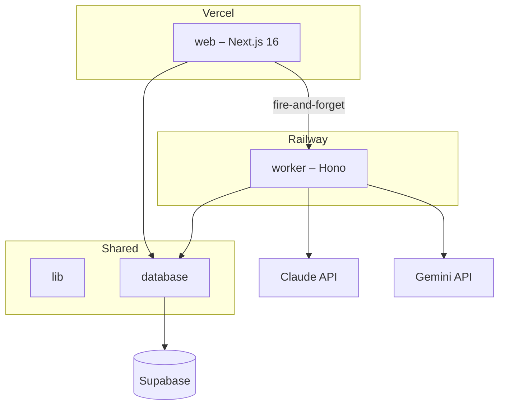

# Clermont AI Portal

AI-powered investment memo creation portal for analysts. Automates a 13-step Standard Operating Procedure (SOP) using Claude (primary author) and Gemini (fact-checker), turning a brief and source documents into a polished, export-ready investment memo.

## Architecture



See [`docs/architecture.md`](docs/architecture.md) for full C4 diagrams (context, container, component).

## Tech Stack

| Package | Framework | Deploy | Purpose |
|---------|-----------|--------|---------|
| `web` | Next.js 16 (App Router) | Vercel | Frontend, API routes, auth |
| `worker` | Hono | Railway | Long-running AI jobs |
| `database` | Supabase types | – | Schema, types, Supabase client |
| `lib` | – | – | Claude/Gemini clients, prompts, types |

## Prerequisites

- Node.js 22+
- npm 10+
- Supabase project (PostgreSQL + Auth)
- Anthropic API key (Claude)
- Google Gemini API key

## Setup

1. Clone the repo and install dependencies:
   ```bash
   git clone <repo-url> && cd clermont-ai-portal
   npm install
   ```
2. Configure environment variables:
   - Copy `.env.example` → `.env.local` (root) and fill in values
   - Copy `.env.example` → `web/.env.local` (Next.js needs its own copy of `DATABASE_URL`)
3. Run database migrations:
   ```bash
   npm run db:migrate
   ```
4. Apply RLS policies in Supabase SQL Editor: `docs/sql/rls-policies.sql`
5. Start development:
   ```bash
   npm run dev
   ```

## Commands

```bash
npm run dev          # Start web (3000) + worker (3001)
npm run build        # Build all apps
npm run typecheck    # TypeScript check all packages
npm run db:gen-types # Regenerate Supabase types after schema changes
```

## Project Structure

```
clermont-ai-portal/
├── web/                     # Next.js frontend + API routes
├── worker/                  # Hono background job server
├── database/                # Supabase generated types + JSONB interfaces
├── lib/                     # AI clients, prompts, pipeline types
├── docs/
│   ├── architecture.md      # C4 diagrams (Mermaid)
│   ├── proposal.pdf         # Original client proposal
│   ├── sync-notes.pdf       # Meeting decisions
│   └── sql/                 # RLS policies
└── CLAUDE.md                # AI coding conventions
```

## 13-Step Pipeline

| Step | Name | Agent | Checkpoint |
|------|------|-------|-----------|
| 1 | Define Task & Prompt | Claude | No |
| 2 | Select Expert Personas | Claude | Yes – pick 5 |
| 3 | Gather Source Material | Upload | Yes – NDA |
| 4 | Generate Persona Drafts | Claude ×5 parallel | No |
| 5 | Synthesize V1 | Claude + thinking | No |
| 6+7 | Style Guide + Edit V2 | Claude (combined) | No |
| 8 | Fact-Check V3 | Gemini | No |
| 9 | Final Style Pass V4 | Claude | No |
| 10 | Human Review V5 | – | Yes – inline |
| 11 | Devil's Advocate | Claude | Yes – select critiques |
| 12 | Integrate Critiques | Claude + thinking | No |
| 13 | Export HTML→PDF | Claude + Puppeteer | No |

## Further Reading

- [`CLAUDE.md`](CLAUDE.md) – coding conventions, architecture rules, pitfalls
- [`docs/architecture.md`](docs/architecture.md) – full C4 architecture diagrams
