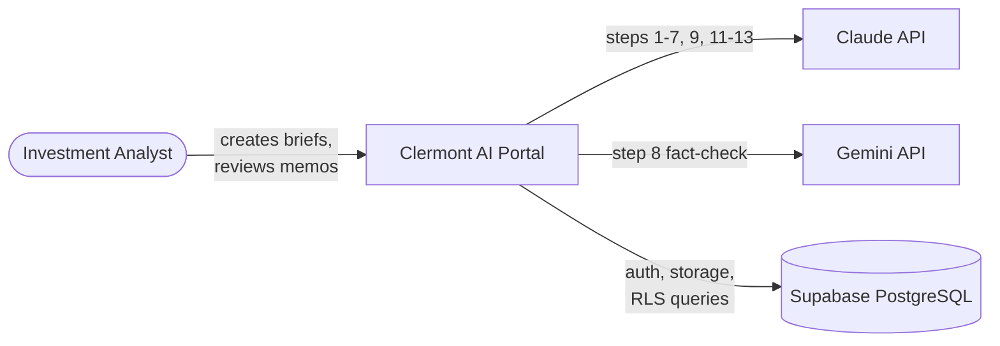
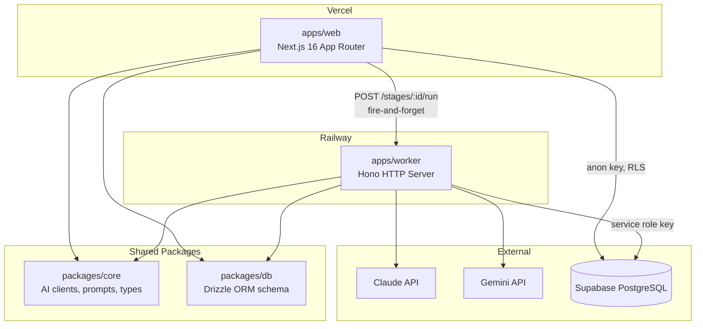
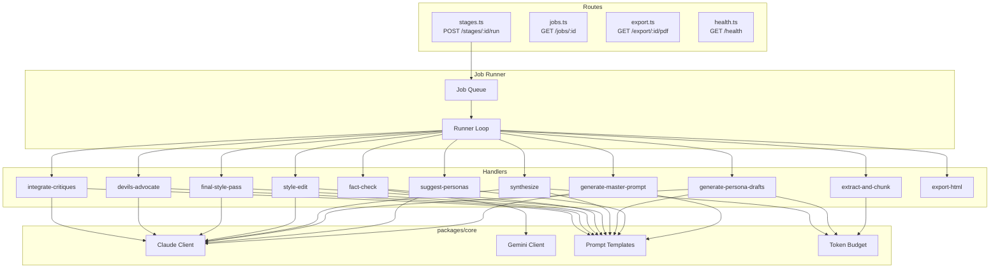

# Architecture – Clermont AI Portal

C4 model diagrams for the investment memo automation platform.

## C1 – System Context

Who interacts with the portal and what external systems it depends on.



## C2 – Container

How the monorepo packages map to deployable units and shared libraries.



## C3 – Component: Worker

The worker receives stage-run requests, queues jobs, and delegates to step-specific handlers.



## C3 – Component: Web

The Next.js app organizes pages, API routes, and UI component groups.

```mermaid
graph TD
    subgraph Pages
        Dashboard[dashboard/]
        ProjectList[projects/]
        Pipeline[projects/id/ – pipeline view]
        AuditLog[projects/id/audit/]
    end

    subgraph API Routes
        Materials[api/materials]
        Personas[api/personas]
        Stages[api/stages]
        StyleGuide[api/style-guide]
        Versions[api/versions]
        Review[api/review]
        Critiques[api/critiques]
        Export[api/export]
    end

    subgraph Components
        Brief[brief/ – BriefWizard]
        Layout[layout/ – Sidebar, Header]
        PersonaUI[personas/ – Cards, Selector]
        ProjectUI[projects/ – Pipeline, StepTrigger]
        ReviewUI[review/ – InlineEditor, CritiqueSelector]
        SourceUI[sources/ – MaterialUpload]
        VersionUI[versions/ – Diff, Viewer]
    end

    WorkerClient[workerClient.runStage]

    Pages --> API Routes
    Pages --> Components
    Stages -->|fire-and-forget| WorkerClient
    Export -->|proxy| WorkerClient
